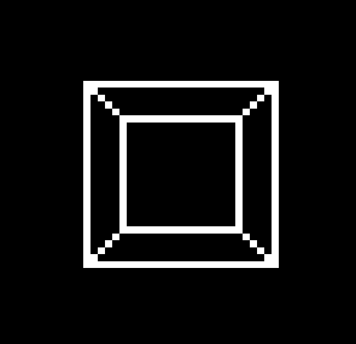

# textual-cube

## Acknowledgements

- The code for rendering and rotating the cube is adapted from
  [drawille](https://github.com/asciimoo/drawille)
- Drawing the cube in Textual was easy thanks to the
  [textual-canvas](https://github.com/davep/textual-canvas) library

## Licence

Licensed under the [GNU General Public License v3.0](LICENSE).
